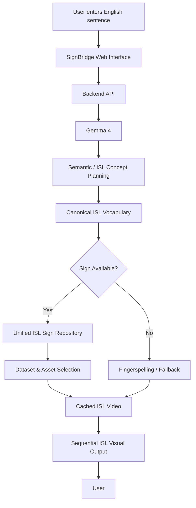
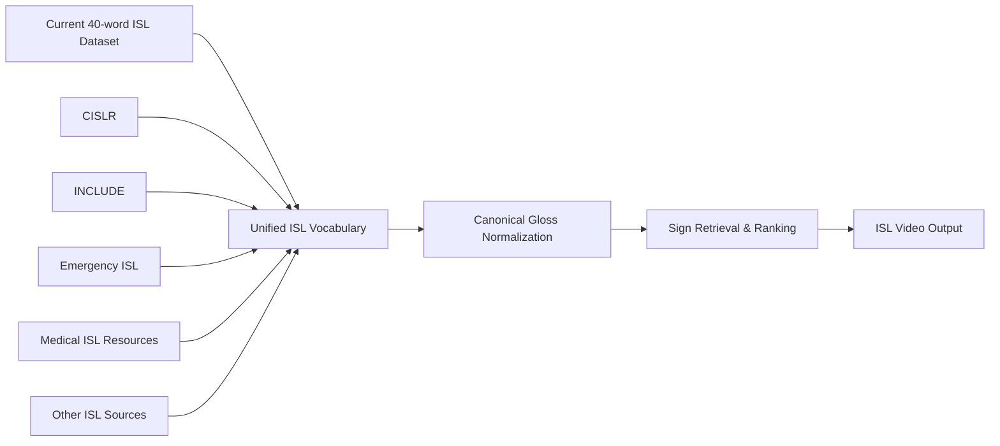

# SignBridge

> **An AI-assisted English-to-Indian Sign Language (ISL) communication system that converts English sentences into meaningful ISL concepts and presents the corresponding signs through visual sign videos.**

## Team

**Team Name:** SignBridge

| Member | Contribution |
| ------ | ------------ |
| [Arun C] | AI/LLM integration and English-to-ISL semantic interpretation |
| [Anand G] | ISL dataset integration, vocabulary mapping and sign retrieval |
| [Abhishek Girish] | Frontend development, UI/UX and video presentation |
| [Jaideep G] | Backend integration, testing and deployment |


---

# Problem Statement

## The Problem

Communication barriers can arise when people who primarily use **Indian Sign Language (ISL)** interact with individuals, services, or digital systems that communicate through written or spoken language.

Many accessibility solutions focus on recognizing sign language and converting it into text or speech. However, the reverse direction — **converting natural-language text into an understandable visual representation of ISL** — remains challenging.

A simple word-by-word dictionary approach is also insufficient because natural English sentences may contain words or expressions that do not directly correspond to available isolated ISL signs.

This creates difficulties in situations such as:

- Healthcare and hospitals
- Emergency communication
- Educational institutions
- Government services
- Transportation
- Public information systems
- Everyday communication

## Why We Chose This Problem

We chose this problem because communication accessibility should not depend on whether two people know the same language or communication modality.

Indian Sign Language is used by a large Deaf community in India, yet many digital systems are still designed primarily around spoken and written languages.

We wanted to build a practical prototype that demonstrates how **AI and existing ISL resources can be combined to make digital communication more accessible**, particularly in situations where a hearing person may not know ISL.

---

# Solution

**SignBridge** acts as a bridge between natural English and Indian Sign Language.

A user enters an English sentence. The system uses **Gemma 4** as a semantic interpretation layer to identify meaningful concepts that can be represented using the available ISL vocabulary.

The resulting concepts are then matched against a unified ISL sign repository containing available sign-video resources from multiple datasets and sources.

The corresponding sign videos are presented sequentially to the user.

### Example

Input:

> **"I need a doctor because I am in pain."**

AI-assisted concept interpretation:

```text
ME → NEED → DOCTOR → PAIN
```

The system then searches for appropriate ISL representations, giving preference to relevant medical/emergency resources when available.

---

## Key Features

- **English-to-ISL concept interpretation using Gemma 4**
- **Unified ISL vocabulary across multiple dataset sources**
- **Real ISL sign-video retrieval instead of AI-generated fake sign movements**
- **Medical and emergency vocabulary support**, including concepts such as doctor, help, pain and accident where corresponding assets are available
- **Dataset-aware sign retrieval and prioritization**
- **Fingerspelling/fallback support for unavailable concepts where suitable assets are available**
- **Local caching of retrieved sign videos**
- **Graceful handling of unavailable signs**
- **Simple web interface for entering English sentences and viewing ISL output**
- **Extensible architecture for adding additional ISL datasets**

---

# Innovation and Differentiation

The main innovation of SignBridge is the combination of **large-language-model semantic understanding with real ISL visual resources**.

Instead of attempting to make an LLM directly generate sign-language movements, SignBridge separates the problem into two stages:

```text
Natural English
      ↓
Gemma 4
      ↓
Meaningful ISL Concepts
      ↓
Unified ISL Vocabulary
      ↓
Verified / Available Sign Resources
      ↓
Visual ISL Output
```

This separation reduces the risk of an AI model inventing physically or linguistically incorrect sign movements.

Another important aspect is the **unified dataset architecture**. Multiple ISL resources may contain the same concept using different naming conventions or formats. SignBridge normalizes these into canonical concepts such as:

```text
DOCTOR
PAIN
HELP
HOSPITAL
MEDICINE
EMERGENCY
```

This allows additional datasets to be incorporated without changing the core application.

The system also prioritizes **high-value domains such as healthcare and emergency communication**, making the prototype more practically relevant than a simple generic word-to-video dictionary.

---

# Technical Implementation

## Architecture



### Dataset Integration Architecture



---

# Technology Stack

| Category | Technologies |
| --------------- | ----------- |
| Frontend | HTML, CSS, JavaScript / existing SignBridge web interface |
| Backend | Python, FastAPI |
| Database | N/A — file-based vocabulary and cached asset repository |
| AI / ML | Gemma 4, Hugging Face ecosystem |
| Infrastructure | Local Python environment / web server |
| APIs / Services | Hugging Face datasets and model/data resources |

---

# How It Works

## 1. User Input

The user enters an English sentence through the SignBridge interface.

Example:

```text
I need a doctor.
```

---

## 2. AI Semantic Interpretation

Gemma 4 receives the sentence and identifies meaningful concepts that can be represented using the available ISL vocabulary.

Example:

```text
ME
NEED
DOCTOR
```

The system constrains the output toward the canonical vocabulary rather than allowing arbitrary hallucinated sign names.

---

## 3. Canonical Vocabulary Matching

The generated concepts are normalized.

For example:

```text
doctor
Doctor
medical doctor
DOCTOR
```

can be mapped to:

```text
DOCTOR
```

This allows different datasets to contribute resources to the same concept.

---

## 4. Sign Retrieval

The system searches the unified repository for a corresponding sign.

Conceptually:

```text
DOCTOR
   ↓
Unified vocabulary
   ↓
Preferred medical/emergency resource
   ↓
Available ISL video
```

If the preferred source is unavailable, the system can search alternative registered sources.

---

## 5. Video Playback

The retrieved videos are presented sequentially.

For:

```text
ME → NEED → DOCTOR
```

the interface can display:

```text
[ME]

[NEED]

[DOCTOR]
```

The visual output allows the user to understand the intended communication through ISL signs.

---

## 6. Fallback

If a direct sign is unavailable, SignBridge can use an appropriate fallback where assets exist.

The intended hierarchy is:

```text
Preferred ISL sign
        ↓
Alternative ISL dataset
        ↓
Fingerspelling
        ↓
Unavailable indication
```

The system does not fabricate missing sign-language videos.

---

# Technical Decisions

### 1. Gemma 4 as a semantic layer

Gemma 4 is used to understand the meaning of an English sentence and produce meaningful concepts.

It is **not** used to generate arbitrary sign-language animations.

This makes the system more controllable and allows the actual visual signs to originate from ISL resources.

### 2. Unified vocabulary

Different datasets use different naming conventions.

A canonical vocabulary allows:

```text
doctor
DOCTOR
Doctor
medical_doctor
```

to potentially resolve to:

```text
DOCTOR
```

while preserving genuinely different meanings as separate concepts.

### 3. Dataset prioritization

When multiple datasets contain the same concept, the retrieval system can rank available resources.

This is particularly useful for medical and emergency concepts.

### 4. Lazy dataset retrieval

Large datasets such as CISLR/iSign should not automatically be downloaded in their entirety just to run the application.

The architecture therefore favors selective retrieval, local caching, and manageable assets.

### 5. Real sign resources

Rather than generating arbitrary sign movements, SignBridge uses available ISL videos/assets.

This makes the prototype more suitable for demonstration and future validation by ISL experts.

---

# Implementation During the Hackathon

During the Hack Day, the team built an end-to-end prototype that connects natural-language input, AI-based semantic interpretation, ISL vocabulary mapping and visual sign retrieval.

Major components completed include:

- English text input interface
- Gemma 4 integration
- ISL concept generation
- Canonical ISL vocabulary
- Multi-dataset sign repository architecture
- ISL dataset integration
- Medical/emergency concept support
- Sign-video retrieval
- Local caching
- Sequential visual presentation
- Fallback handling
- Backend API integration
- Error handling and validation

The project was designed to remain extensible so that additional ISL datasets can be incorporated without rebuilding the entire application.

---

## Team Contributions

- **[Member Name]:** AI/LLM integration, Gemma 4 prompting and semantic concept extraction
- **[Member Name]:** ISL dataset research, dataset integration and canonical vocabulary development
- **[Member Name]:** Frontend development, UI/UX and ISL video presentation
- **[Member Name]:** Backend development, API integration, testing and deployment

> Replace the placeholders with your actual names and adjust the contributions according to your team's work.

---

# Working Application

**Live Application:** [Add deployed application URL]

The application allows users to enter an English sentence and obtain a sequence of corresponding ISL concepts and available visual sign representations.

The intended demonstration flow is:

```text
Enter English sentence
        ↓
Click Translate
        ↓
Gemma 4 interprets sentence
        ↓
ISL concepts generated
        ↓
Signs retrieved
        ↓
ISL videos displayed
```

---

# Demo Video

**Demo Video:** [Add demo video URL]

The demonstration should cover:

1. Opening SignBridge
2. Entering an English sentence
3. AI interpretation
4. Displaying ISL concepts
5. Retrieving sign videos
6. Demonstrating a medical/emergency example
7. Demonstrating fallback behavior
8. Showing the final visual output

### Recommended demo sentence

> **"I need a doctor because I am in pain."**

This demonstrates the project's medical/emergency capability particularly well.

---

# Open Source and AI Usage

## AI / Models

### Gemma 4

**Purpose:** Natural-language understanding and semantic concept planning.

Gemma 4 converts the user's English sentence into meaningful concepts that can be mapped to the available ISL vocabulary.

The model is not used to fabricate sign-language movements.

---

## Open Source Components

### FastAPI

Used to provide the backend API and connect the web interface with the AI and sign-retrieval pipeline.

### Hugging Face

Used as a source for publicly available models and datasets used by the SignBridge system.

### ISL Isolated 40 Words Dataset

Used as an initial manageable collection of Indian Sign Language sign videos for the prototype.

### CISLR

Used/planned as a larger isolated-sign vocabulary source where access and licensing requirements permit.

### Emergency ISL Dataset

Provides useful emergency-related signs such as:

- doctor
- help
- pain
- accident
- call
- hot
- lose
- thief

### ISL Fingerspelling Resources

Used/planned as a fallback mechanism for concepts that do not have a direct available sign.

> Dataset licenses, attribution requirements and source-specific usage restrictions should be retained with the corresponding dataset metadata before public redistribution.

---

# Setup and Usage

## Prerequisites

- Python 3.x
- Internet connection for external Hugging Face resources
- Required Python packages
- Gemma-compatible API/model access where required
- Modern web browser

---

# Installation

```bash
git clone [repository-url]
cd signbridge
```

Create a virtual environment:

### Windows

```bash
python -m venv .venv
.venv\Scripts\activate
```

### Linux/macOS

```bash
python3 -m venv .venv
source .venv/bin/activate
```

Install dependencies:

```bash
pip install -r requirements.txt
```

---

# Environment Variables

Create a `.env` file if required by the selected Gemma configuration.

Example:

```env
GEMMA_API_KEY=your_api_key_here
```

If the implementation uses a different provider/model endpoint, use the environment variables specified in the project's configuration.

**Never commit real API keys to GitHub or Devpost.**

---

# Running the Project

Start the FastAPI application:

```bash
uvicorn app.main:app --reload
```

Then open:

```text
http://127.0.0.1:8000
```

---

# Usage

1. Open the SignBridge web interface.
2. Enter an English sentence.
3. Click **Translate**.
4. Gemma 4 interprets the sentence.
5. The system generates canonical ISL concepts.
6. The unified vocabulary searches for appropriate sign resources.
7. Corresponding ISL videos are retrieved.
8. The signs are presented visually in sequence.
9. If a sign is unavailable, the system attempts an appropriate fallback.

### Example

Input:

```text
I need a doctor.
```

Possible concept sequence:

```text
ME → NEED → DOCTOR
```

Medical/emergency resources are prioritized when available.

---

# Challenges and Learnings

## Dataset Fragmentation

ISL datasets are distributed across different sources, formats, vocabularies and recording styles.

A major engineering challenge was therefore not simply downloading datasets, but creating a **common representation of ISL concepts**.

## Vocabulary Differences

Different datasets may represent the same concept using different gloss names.

A canonical vocabulary and normalization layer were introduced to address this.

## Dataset Size

Some modern ISL datasets are very large.

Downloading every dataset in full is impractical for a hackathon application.

The project therefore uses a selective and cache-based approach.

## Language vs Sign Language

English and ISL should not be treated as simple one-to-one word mappings.

The use of an LLM as a semantic layer helps bridge natural-language variation before sign retrieval.

## Reliable Sign Generation

A major learning was that generating an arbitrary animation is not equivalent to generating valid ISL.

Therefore, SignBridge separates:

```text
Language understanding
```

from:

```text
Actual sign representation
```

and relies on real ISL resources for the visual output.

---

# Future Improvements

Potential future development includes:

- Full continuous-sentence ISL translation
- ISL grammar-aware reordering
- More extensive medical vocabulary
- Government-service vocabulary
- Transportation vocabulary
- Education vocabulary
- Real-time conversation mode
- Speech-to-text input
- ISL-to-text reverse translation
- 3D sign-language avatar
- Better fingerspelling integration
- Sign-quality ranking using ISL expert validation
- Mobile application
- Offline/on-device inference
- User personalization
- Evaluation with Deaf/HoH users and certified ISL interpreters

The long-term goal is to evolve SignBridge from a concept-to-sign retrieval prototype into a more complete **bidirectional ISL accessibility platform**.

---

# Devpost Submission

**Devpost Project:** [Add Devpost Project URL]

The Devpost submission should contain:

- Project description
- Problem statement
- Solution
- Architecture
- Technology stack
- Screenshots
- Demo video
- Live application
- Repository
- Team members
- AI usage
- Dataset acknowledgements
- License information

---

# Credits and License

## Credits

SignBridge uses and/or is designed to integrate resources from publicly available Indian Sign Language datasets and open-source technologies.

Relevant resources include:

- Hugging Face datasets
- ISL isolated-word datasets
- CISLR
- INCLUDE
- Emergency ISL resources
- ISL medical resources
- ISL fingerspelling resources
- Gemma
- FastAPI
- Python ecosystem libraries

All external datasets, models and libraries should retain their original attribution and licensing requirements.

---

# License

**[Choose project license — e.g., MIT License]**

External datasets and models remain subject to their respective licenses and usage restrictions.

---

# Submission Checklist

- [x] Project title and description added
- [ ] All team members listed
- [x] Problem clearly explained
- [x] Reason for choosing the problem explained
- [x] Solution and key features documented
- [x] Innovation and differentiation explained
- [x] Architecture included
- [x] Technical implementation documented
- [x] Work completed during the hackathon documented
- [ ] Team contributions finalized
- [ ] Working application tested on final deployment
- [ ] Live application link added
- [ ] Demo video added
- [x] AI and open-source components documented
- [x] Setup and usage instructions documented
- [x] Challenges and learnings documented
- [ ] Devpost submission completed
- [ ] Devpost link added
- [ ] Credits finalized
- [ ] License finalized
- [x] Repository organized
